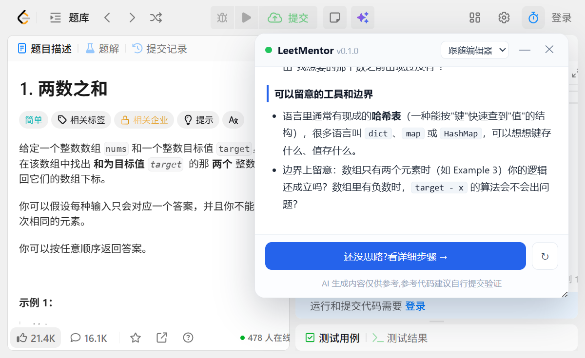
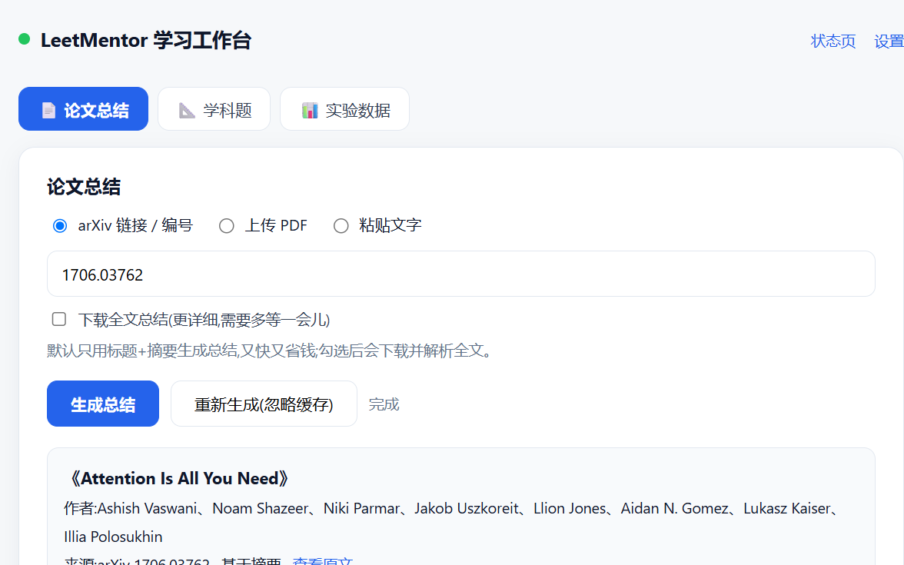

# LeetMentor — 本地 AI 学习助手

开源、本地运行的 AI 学习助手:**力扣三层讲解 · 学科题划词/识图 · 论文总结 · 实验数据分析 · 文件转换工具箱**。
API Key 与所有数据只保存在你自己的电脑上,不上传云端。

## 🚀 30 秒装好,马上用

| 我要…… | 怎么做 |
|---|---|
| **装浏览器插件**<br><small>力扣讲解 / 划词 / 识图</small> | ① Edge 安装 [Tampermonkey](https://microsoftedge.microsoft.com/addons)(商店搜索即可)<br>② ⭐ [**点此一键安装脚本**](https://greasyfork.org/zh-CN/scripts/597659)(Greasy Fork,点绿色「安装此脚本」) |
| **装本地服务**<br><small>所有 AI 功能的"发动机"</small> | ① 到 [Releases](../../releases) 下载 `LeetMentor-vX.X.X-win64.zip`,解压<br>② 双击 `LeetMentorServer.exe`(免安装 Python)<br>③ 在自动打开的设置页填入自己的 [DeepSeek API Key](https://platform.deepseek.com/api_keys) |

> 完整图文步骤见下文「三步开始使用」;遇到问题先看「常见问题」。

## 🖼 效果预览

**力扣题目:三层引导式讲解**(按钮可拖动到任意位置)



**学习工作台:论文总结**(arXiv 链接 / 上传 PDF / 粘贴文字)



**论文详细分析**(含实验思路与结果表格)


## ✨ 特性

- **三层引导式讲解**:不是一次性甩答案,而是一层层展开,每层都留时间给你思考
- **语言随时切换**:Python3 / Java / C++ / JavaScript / Go / C# / Rust 等 19 种,
  默认跟随编辑器;切换语言只重新生成第 3 层
- **本地优先**:API Key 和缓存只保存在你自己的电脑上;服务只监听 `127.0.0.1`
- **省钱缓存**:同一道题的同一层讲解只请求一次,重复查看零成本
- **Edge 优先**:在 Microsoft Edge(及 Chrome 等 Chromium 浏览器)上即装即用
- **位置随心**:「✨ AI 讲解」按钮和讲解面板都能用鼠标**拖动**到任意位置,位置自动记住
- **论文总结**:学习工作台(`/study`)支持 arXiv 链接 / 上传 PDF / 粘贴文字,
  生成面向初学者的结构化总结(结论 / 问题 / 方法 / 结果 / 局限 / 术语表);
  可选**简单分析**(摘要)或**详细分析**(全文 + 实验思路 + 结果表格 + 启示与反思)
- **学科题划词 / 识图**:任意网页选中文字 → ✨ → 讲解;或**粘贴截图 / 图片** →
  识图解题(自动识别题目文字和公式),支持连续追问
- **文件转换工具箱**:图片→PDF、PDF 合并/拆分/转图片/加密解密、Office→PDF、
  PDF→Word 等常用转换,**全部在本机完成、免费、不上传云端**
- **实验数据分析**:上传 CSV / Excel 或粘贴数据 → 本地计算统计(均值 / 标准差 / 相关性)
  + 自动绘图(分布 / 趋势 / 散点 / 分类计数)+ AI 解读与下一步实验建议

## 🔧 工作原理

```
Edge + 油猴脚本(Tampermonkey)
   │  读取题目(优先力扣官方接口,失败则解析页面)
   ▼
本地服务(127.0.0.1:8765,Python FastAPI)
   │  组织三层提示词 / SQLite 缓存
   ▼
DeepSeek API(流式输出,可换成任意 OpenAI 兼容服务)
```

## 🚀 三步开始使用(Windows + Edge)

### 第 1 步:安装并启动本地服务

> 🚀 **不想装 Python?** 直接到 [Releases](../../releases) 下载 `LeetMentor-vX.X.X-win64.zip`,
> 解压后双击 `LeetMentorServer.exe`(建议改双击桌面「启动 LeetMentor」静默启动的方式来日常使用)。

1. 安装 [Python 3.10+](https://www.python.org/downloads/)(安装时勾选 *Add python.exe to PATH*)
2. 双击 `scripts\setup.bat` 安装依赖(第一次约 1~2 分钟)
3. 双击 `scripts\start.bat` 启动服务(第一次建议用它,能看到日志)

> 之后日常使用:双击桌面的 **「启动 LeetMentor」** 快捷方式(静默运行、**无窗口**);
> 需要停止时双击 `scripts\stop.bat`。调试服务时才需要用 `start.bat`(带日志窗口)。

### 第 2 步:配置 DeepSeek API Key

1. 到 [platform.deepseek.com](https://platform.deepseek.com/api_keys) 注册,创建一个 API Key
   (充 10 元足够用很久,每道题三层讲解成本不到 1 分钱)
2. `start.bat` 启动后浏览器会自动打开设置页(`http://127.0.0.1:8765/setup`),
   粘贴 Key,点「保存」,再点「测试连接」确认通过

### 第 3 步:在 Edge 安装油猴脚本

1. 打开 Edge → 进入 [Microsoft Edge 加载项商店](https://microsoftedge.microsoft.com/addons)
   → 搜索 **Tampermonkey** → 安装
2. 安装脚本(二选一):
   - ⭐ **一键安装(推荐)**:打开 [Greasy Fork 脚本页](https://greasyfork.org/zh-CN/scripts/597659),
     点绿色「安装此脚本」按钮
   - 手动安装:下载本项目 `userscript\leetcode-mentor.user.js`,**直接拖进浏览器窗口**,
     在打开的安装页点「安装」
3. 打开任意力扣题目页(例如 [两数之和](https://leetcode.cn/problems/two-sum/)),
   页面右下角出现 **✨ AI 讲解** 按钮,开用!

## 📖 日常使用

1. 双击桌面「启动 LeetMentor」快捷方式(静默运行,无窗口)
   - 重复双击不会重复启动;想停止服务时双击 `scripts\stop.bat`
   - 调试服务时可用 `scripts\start.bat`(带日志窗口);便携版则是 `LeetMentorServer.exe`
2. 打开力扣题目页 → 点右下角「✨ AI 讲解」
3. 按按钮提示一层层推进:
   - **第 1 层 · 思路引导**:知识点、题意复述、引导思考的问题(不给答案)
   - **第 2 层 · 详细步骤**:暴力解法 → 瓶颈 → 优化 → 伪代码 → 复杂度
   - **第 3 层 · 参考代码**:所选语言的完整代码 + 逐段讲解 + 易错点 + 相似题
4. 面板顶部可切换参考代码语言;「↻」按钮可忽略缓存重新生成
5. **任意网页划词 / 截图**:选中文字点浮出的「✨ 讲解」;或在面板里 **Ctrl+V 粘贴截图**
   → 识图解题(也可以点 📷 选择图片),支持连续追问
6. **学习工作台**(http://127.0.0.1:8765/study):论文总结、学科题(识图)、实验数据分析、文件转换工具箱

## 📄 论文总结(学习工作台)

1. 服务启动后,打开 **http://127.0.0.1:8765/study**(或点状态页上的「学习工作台」链接)
2. 三种方式任选:
   - **arXiv 链接/编号**:粘贴 `https://arxiv.org/abs/1706.03762` 或直接填 `1706.03762`;
     默认用"标题+摘要"生成总结(快、便宜);勾选「下载全文总结」会下载 PDF 并解析全文(更详细、更慢)
   - **上传 PDF**:拖拽或点击选择本地 PDF(最大 40MB;扫描版图片 PDF 暂不支持)
   - **粘贴文字**:把摘要或正文复制进来,适合不在 arXiv 上的论文
3. 生成结果包含:一句话结论 / 研究问题 / 方法 / 主要结果 / 贡献与局限 / 术语表 / 值得思考的问题
4. 同一篇论文只请求一次(按文件内容/arXiv 编号缓存),再次查看零成本;「重新生成」可忽略缓存

## 🧰 文件转换工具箱

工作台「工具箱」标签,全部本机完成、免费:

| 类别 | 功能 |
|---|---|
| 图片 | 图片→PDF(多张自动合并、适配 A4)、格式转换(JPG/PNG/WebP)、压缩、拼长图 |
| PDF | 合并 / 提取页面 / 拆分 / 旋转 / 加密 / 解密 / 转高清图片 |
| Office | Word / Excel / PPT / TXT → PDF(自动探测 LibreOffice、MS Office、WPS) |
| 文档 | PDF → Word(纯文本版,beta;扫描版 PDF 不支持) |

> 转换后的文件在工作台直接下载,临时文件 2 天后自动清理。

## ❓ 常见问题

| 问题 | 解决 |
|---|---|
| 提示「本地服务未运行」 | 确认服务在运行(浏览器打开 `http://127.0.0.1:8765/health` 能看到 JSON 即为正常);重新启动:双击桌面「启动 LeetMentor」;点面板中的「重试」 |
| 提示「API Key 无效」 | 打开 `http://127.0.0.1:8765/setup` 重新填写并测试 |
| 无法连接 DeepSeek | 检查网络/代理;程序需要能访问 `api.deepseek.com` |
| 题目读取失败 | 刷新页面重试;会员专享题完整题面可能读不到 |
| Edge 里看不到油猴图标 | `edge://extensions` 里把 Tampermonkey 固定到工具栏 |
| 想换模型 | 设置页可切换 `deepseek-chat`(快)/ `deepseek-reasoner`(推理强) |
| 便携版 exe 提示「已被组织策略 / Device Guard 阻止」 | 这台电脑开启了 **Smart App Control(智能应用控制)**,它会拦截所有未签名的 exe。解法:改用**源码方式**(`scripts\setup.bat` + `scripts\start.bat`),或在 Windows 安全中心 → 应用和浏览器控制 里关闭 Smart App Control(关闭后需重装系统才能再开启) |

## 💰 成本说明

- 每道题三层讲解合计约几千 tokens,**成本 < 1 分钱**
- 同一道题重复查看走本地缓存,**零成本**
- 切换语言只重新请求第 3 层
- 价格以 [DeepSeek 官网](https://platform.deepseek.com/pricing) 为准

## 📁 项目结构

```
leetcode-mentor/
├─ server/                 # 本地服务(Python + FastAPI)
│  ├─ main.py              #   入口:API / 设置页 / 工作台 / 端口自适应
│  ├─ prompts.py           #   ★ 提示词(三层讲解 + 论文总结,核心资产)
│  ├─ llm.py               #   DeepSeek 客户端(流式,可换兼容服务)
│  ├─ cache.py             #   SQLite 缓存
│  ├─ leetcode.py          #   按 slug 抓题(服务端兜底)
│  ├─ papers.py            #   arXiv 抓取 / PDF 下载 / PDF 文本提取
│  ├─ data_analysis.py     #   实验数据统计(pandas)+ 自动绘图(matplotlib)
│  ├─ toolbox.py           #   文件转换(图片/PDF/Office,本地完成)
│  ├─ image_utils.py       #   图片压缩与格式处理(识图 / 工具箱共用)
│  ├─ html_text.py         #   题面 HTML → 文本
│  ├─ languages.py         #   语言映射表(加语言只改这里)
│  ├─ setup_page.py        #   设置页
│  └─ study_page.py        #   学习工作台(论文总结)
├─ userscript/
│  └─ leetcode-mentor.user.js   # 油猴脚本(Edge 端界面)
├─ scripts/
│  ├─ setup.bat            # 一键安装依赖
│  ├─ start.bat            # 启动服务(带日志窗口,调试用)
│  ├─ stop.bat             # 停止静默运行的服务
│  ├─ stop_server.py       #   停止脚本的实现
│  ├─ test_cli.py          # 命令行测试讲解质量
│  ├─ build_exe.bat        # 打包便携版(免安装 Python)
│  └─ launcher.py          # 打包入口
├─ docs/使用说明.txt        # 便携版附带说明
├─ data/                   # 自动生成:config.json + cache.db(勿外传)
└─ config.example.json
```

## 🛠 开发者

```powershell
# 命令行直接生成某道题的讲解(不需要浏览器)
.venv\Scripts\python scripts\test_cli.py two-sum            # 三层全生成
.venv\Scripts\python scripts\test_cli.py two-sum --level 1  # 只生成第 1 层
.venv\Scripts\python scripts\test_cli.py two-sum --lang java --force
```

- 调试界面/流程时可用 `LEETMENTOR_FAKE_LLM=1` 环境变量,不调用真实 API
- 修改 `server/prompts.py` 后,把 `PROMPT_VERSION` +1,旧缓存自动失效
- 想支持新语言:在 `server/languages.py` 加一行即可
- 想支持新网站(牛客/洛谷等):题面提取逻辑在油猴脚本里做适配,服务端不变

## 📦 打包便携版(在其他电脑上使用)

> 推送 `v*` 标签时,GitHub Actions 会**自动**构建并发布到 Releases(见 `.github/workflows/release.yml`),一般不需要手动打包。

手动打包:
1. 双击 `scripts\build_exe.bat`
2. 生成 `dist\LeetMentor-vX.X.X-win64.zip`(含 exe、油猴脚本、说明)
3. 拷到其他 Windows 电脑解压 → 双击 `LeetMentorServer.exe` → 按浏览器提示走

> 便携版**不需要安装 Python**;配置和缓存保存在 exe 同目录的 `data\` 里,
> 整个文件夹可拷 U 盘随身携带。
>
> ⚠️ 如果目标电脑开启了 **Smart App Control(智能应用控制)**,未签名的 exe 会被
> 系统拦截(提示"已被组织策略/Device Guard 阻止")。这是系统安全功能,不是程序问题;
> 可改用源码方式运行,或在该电脑的 Windows 安全中心里关闭 Smart App Control。

## 🗺 后续计划

- 公式渲染(KaTeX):数学公式更美观
- 实验数据:多文件对比、导出分析报告
- 错题本 / 收藏 / 学习记录
- LeetCode 国际站、牛客网、洛谷适配
- 论文:按章节追问、多篇对比

---

## 📜 开源许可

本项目使用 [MIT License](LICENSE) 开源,欢迎自由使用、修改与分享。

给想安装的朋友的两条快捷路径:

- **本地服务**:到 [Releases](../../releases) 下载 `LeetMentor-vX.X.X-win64.zip`,解压后双击 `LeetMentorServer.exe`
- **油猴脚本**:⭐ [一键安装(Greasy Fork)](https://greasyfork.org/zh-CN/scripts/597659);
  或安装 Tampermonkey 后,把发布包里的 `leetcode-mentor.user.js` 拖进浏览器即可

---

仅供个人学习使用。AI 生成内容可能有误,参考代码请自行提交验证。
